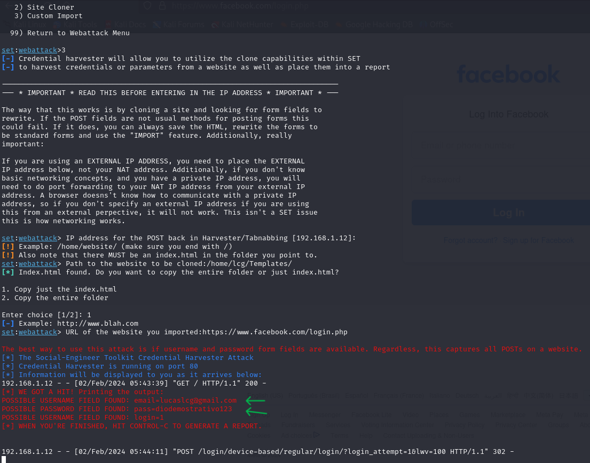

# Phishing para captura de senhas do Facebook

### Ferramentas

- Kali Linux
- setoolkit
- Extensions firefox (SingleFile)
  
### Configurando o Phishing no Kali Linux

- Acesso root: ``` sudo su ```
- Iniciando o setoolkit: ``` setoolkit ```
- Tipo de ataque: ``` Social-Engineering Attacks ```
- Vetor de ataque: ``` Web Site Attack Vectors ```
- Método de ataque: ```Credential Harvester Attack Method ```
- Método de ataque: ``` Custom Import ```
- Obtendo o endereço da máquina: ``` IP address ```
- baixe copia do site: https://www.facebook.com/login.php
- Obtendo caminho do arquivo .html baixado com a Extensions SingleFile:  ``` website to be cloned ```
- comfirma para usar somente o index.html  ``` Copy just the index.html ```
- informa URL a ser redirecionado pos coleta de credenciais: https://www.facebook.com/login.php ``` URL of the website you imported ```

### Resutados


